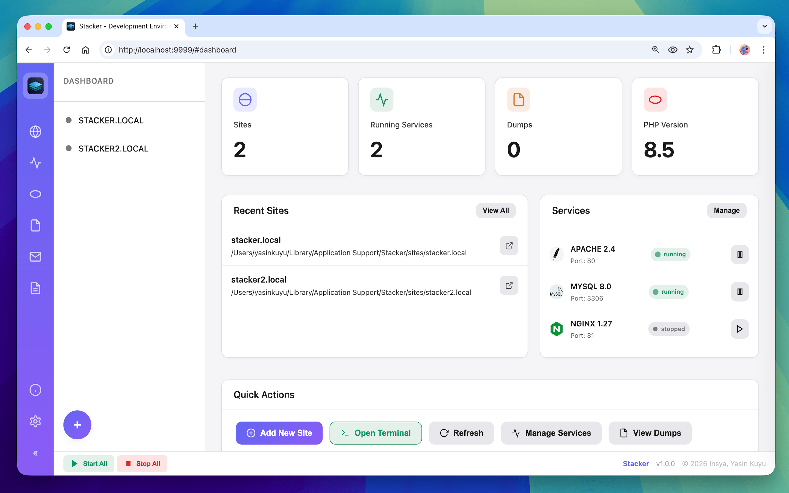
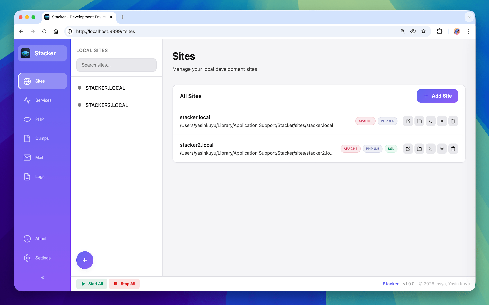
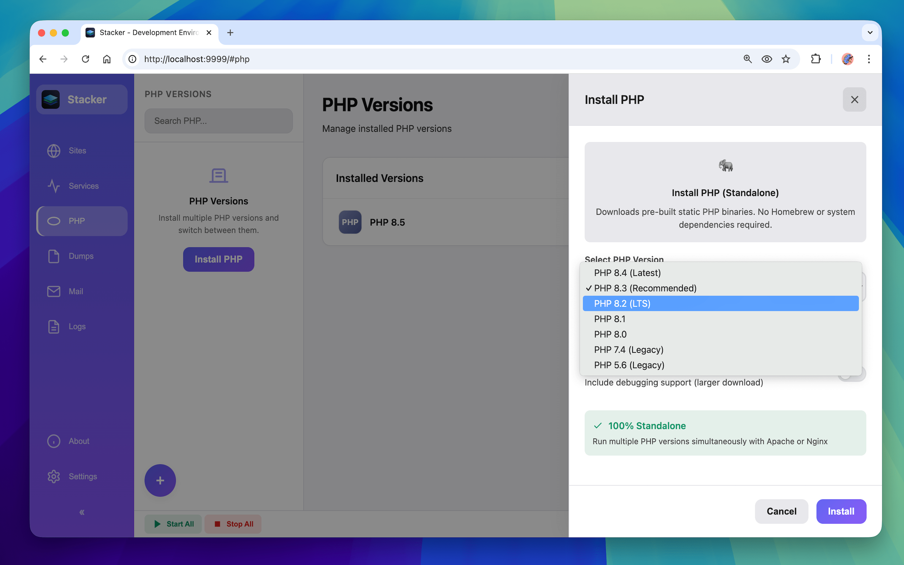
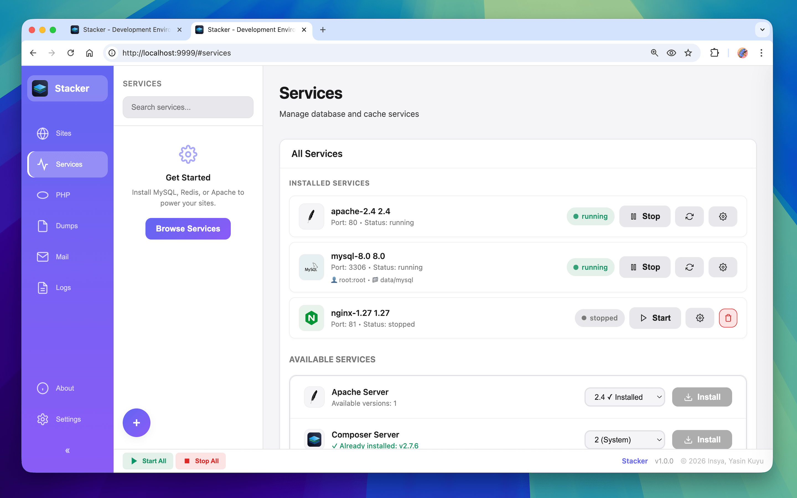

<p align="center">
  
</p>

# 🚀 Stacker

**Modern, High-Performance Local Development Environment for PHP, Nginx, Apache, and MySQL.**

Stacker is a modern, standalone development environment tailored for PHP developers who need speed, flexibility, and control. Built from the ground up in **Go**, it delivers a high-performance management layer that stays out of your way while providing everything you need to build, test, and debug.

Unlike traditional stacks that pollute your system with global dependencies, Stacker keeps everything self-contained within its own data directory. It empowers you to run multiple PHP versions (from 5.6 to 8.4) and switch between Nginx and Apache on a per-site basis—all running simultaneously. Every feature is baked in, from automatic SSL via `mkcert` to "Pro" tools like a built-in SMTP Mail Catcher, real-time Log Viewer, and a Dump Interceptor, giving you a premium developer experience entirely for free.

> 💎 **Premium features. Zero cost.** Everything you'd pay for in other tools is included for free.

[](https://github.com/yasinkuyu/Stacker)
[](LICENSE)
[](https://github.com/yasinkuyu/Stacker/stargazers)

## 📸 Screenshots

<p align="center">
  <a href="assets/screenshot1.png"></a>
  <a href="assets/screenshot2.png"></a>
  <a href="assets/screenshot3.png"></a>
  <a href="assets/screenshot4.png"></a>
</p>

---

## 🌟 Why Stacker?

Most local development tools are either too heavy, platform-locked, or outdated. Stacker solves this by providing a unified experience that is:

*   **⚡ Faster**: Powered by Go, the management layer is virtually instant.
*   **📦 Portable**: All services are self-contained in a dedicated data directory. No system-wide pollution.
*   **🌐 All-in-One**: Built-in Mail Catcher, Log Viewer, and Dump Interceptor.
*   **🛠️ Flexible**: Switch PHP versions, enable/disable XDebug, and manage multiple services with one click.
*   **🆓 100% Free**: No subscriptions, no "Pro" tier—every feature is unlocked.

---

## 🚀 Key Features

### 🌐 Site & Server Management
*   **Instant Sites**: Add, list, and remove local sites in seconds.
*   **Multi-Server**: Choose Apache or Nginx per site—run both servers simultaneously.
*   **Automatic HTTPS**: Built-in SSL certificate management via `mkcert`.
*   **Hosts Management**: Automatically handles your `/etc/hosts` for `.test` domains.
*   **Modern Web UI**: A beautiful, responsive dark-themed dashboard to control everything.

### 🐘 Multi-PHP Power
*   **Multi-PHP**: Install and run multiple PHP versions (5.6 to 8.4) side by side.
*   **Per-Site PHP**: Assign different PHP versions to different sites.
*   **XDebug Pro**: One-click XDebug management for effortless debugging.
*   **Node.js Integration**: Built-in support for managing Node.js versions.

### ⚙️ Standalone Services
Stacker downloads and compiles services directly on your machine for maximum compatibility:
*   **Databases**: MariaDB (10.x, 11.x) and MySQL (5.7, 8.0).
*   **Web Servers**: Nginx and Apache running simultaneously on different ports.
*   **Cache**: Redis.

### 🛠️ Developer Tooling (Usually "Pro" Features—Free Here)
*   **📧 Mail Catcher**: Local SMTP server and viewer—never send a test email to a real user again.
*   **📦 Dump Interceptor**: Intercept and view `dump()` and `dd()` output in a clean UI.
*   **📄 Log Viewer**: Advanced log management with search and real-time tailing.
*   **🔗 Forge Integration**: Deploy your local projects to Laravel Forge directly from Stacker.

---

## 💻 Installation

### 🍏 macOS (Recommended)
1. Download the latest `.app` bundle from [Releases](https://github.com/yasinkuyu/Stacker/releases).
2. Move it to your `Applications` folder.
3. Run `Stacker.app` to use the **System Tray** application (best experience).

### 🐧 Linux & 🪟 Windows
1. Download the binary for your platform from [Releases](https://github.com/yasinkuyu/Stacker/releases).
2. Open your terminal and run:
   ```bash
   ./stacker ui
   ```
3. Open your browser to `http://localhost:9999`.

---

## 🛠️ Build from Source
If you prefer to build it yourself, ensure you have Go 1.19+ installed:
```bash
git clone https://github.com/yasinkuyu/Stacker.git
cd Stacker
./build.sh
```

---

## 📂 Data Directory Structure
Stacker keeps everything organized in a single location:
*   **macOS**: `~/Library/Application Support/Stacker/`
*   **Linux**: `~/.stacker/`
*   **Windows**: `%APPDATA%/Stacker/`

---

## 🛠️ Requirements & Dependencies
*   **Xcode Command Line Tools** (macOS) or **build-essential** (Linux) for service compilation.
*   **cmake** and **make** (for building MariaDB/MySQL).
*   **mkcert** (for SSL/HTTPS support).

---

## 🤝 Contributing
Stacker is open-source and we love contributions!
1. Fork the Project.
2. Create your Feature Branch (`git checkout -b feature/AmazingFeature`).
3. Commit your Changes (`git commit -m 'Add some AmazingFeature'`).
4. Push to the Branch (`git push origin feature/AmazingFeature`).
5. Open a Pull Request.

---

## 🔄 Transitioning from Other Tools?

Stacker is designed to be a lightweight and standalone alternative for developers using tools like **XAMPP**, **Laragon**, **MAMP PRO**, or **Laravel Herd Pro**. It provides the same (and often more) capabilities—such as multi-PHP support and built-in developer tools—without the heavy system footprint or expensive subscription tiers.

---

## 📄 License
Distributed under the MIT License. See `LICENSE` for more information.

---

**Developed with ❤️ by [Insya](https://github.com/insya)**

